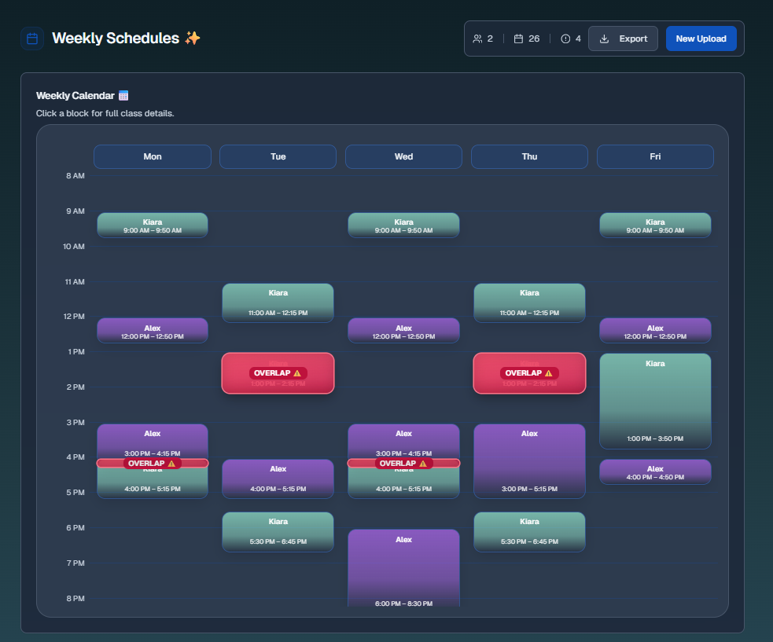
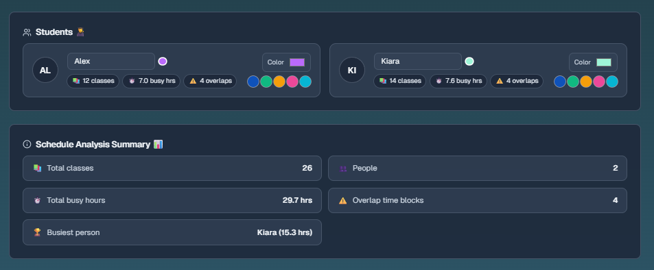

# AreWeFree? 📅

a little app i made to figure out when me and my friends are actually free. throw your calendar files at it and it shows you when everyone's busy so you can plan stuff without the usual scheduling nightmare.

**made specifically for University of Pittsburgh students** - get your schedule from PeopleSoft → Schedule → Download (.ics). might work with other schools but no promises 🤷‍♂️

---

## 🎬 Demo

**Live Demo:** [https://arewefree.netlify.app/](https://arewefree.netlify.app/)

**Showcase Images:**  
  

---

## what it does

- upload `.ics` files from Pitt's PeopleSoft (PeopleSoft → Schedule → Download .ics)
- rename files because "Spring Term 2023-2024 calendar.ics" isn't helpful
- assign colors for visual clarity
- shows week view (mon-fri) with overlap detection
- highlights conflicts in red
- click blocks to see details
- export as PNG for sharing
- 8am to 8pm timeframe (reasonable student hours)

**note**: built for Pitt's academic schedule format, compatibility with other universities is untested

## why this exists

group projects need better scheduling. this makes it slightly less painful.

## features
- ✅ drag & drop file upload
- ✅ rename contacts to actual names
- ✅ color coding system
- ✅ overlap detection in red
- ✅ detailed event info on click
- ✅ PNG export functionality
- ✅ file validation
- ✅ 10min walking buffer between classes

## tech stack
- next.js (app router)
- typscript
- tailwind + shadcn/ui
- ical.js for parsing
- html-to-image for exports

## usage flow
1. upload .ics files
2. rename people to readable names
3. assign colors
4. parse schedules
5. view overlaps and conflicts
6. export for group sharing

---
*built by a cs student who got tired of scheduling chaos (with a TON of AI help along the way)*